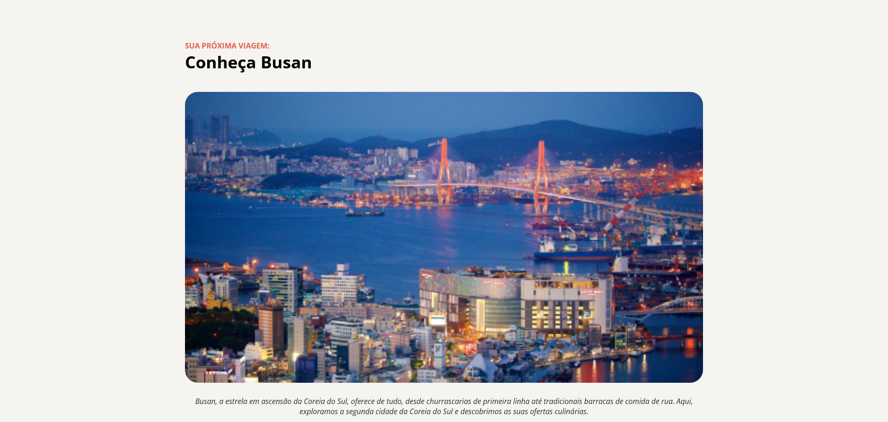

<h1 align="center">Página de Local Turistico</h1>

Página web com informações sobre um determinado local turístico.

# 🔥 Introdução
O objetivo desse projeto foi colocar em prática o conhecimento básico de desenvolvimento web.

## 📦 Tecnologias usadas:
- 
- 

## 👷 Autores
- Criado pela [@Rocketseat](https://github.com/Rocketseat)
- Desenvolvido por [@tatyanepgoncalves](https://github.com/tatyanepgoncalves)